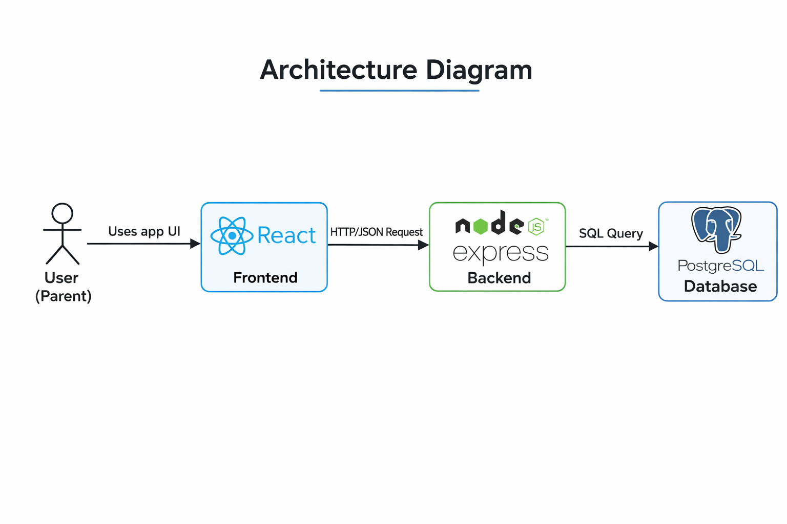

# Healthy Habits

## 1. App Summary

Healthy Habits is a family wellness tracking app that helps parents build consistent daily routines around nutrition, physical activity, and balanced screen use for their children. Many families struggle to track these habits in one place, making progress hard to see and harder to sustain. This app consolidates the core habit categories — fitness, diet, screen time, and goals — into a single parent-managed dashboard with child-specific profiles. The primary user is a parent or caregiver overseeing one or more children; a secondary user is a coach or admin with broader access across families. Parents can add and track health goals for each child, view activity and nutrition logs, and monitor screen-time trends in a clean, kid-friendly interface. The vertical slice implemented in this version delivers full CRUD functionality for the Goals feature, with data persisted to a local PostgreSQL database through a REST API. The long-term objective is to extend live persistence across all feature areas and add authentication.

---

## 2. Tech Stack

### Frontend
| Technology | Version | Role |
|---|---|---|
| React | 19 | UI component library |
| TypeScript | 5.7 | Static typing |
| Vite | 6 | Dev server and bundler |
| Custom CSS | — | Glassmorphism design system |

### Backend
| Technology | Version | Role |
|---|---|---|
| Node.js | 18+ | JavaScript runtime |
| Express | 4 | HTTP server and routing |
| `pg` (node-postgres) | 8 | PostgreSQL client |
| `cors` | 2 | Cross-origin request handling |
| `dotenv` | 16 | Environment variable loading |
| `concurrently` | 9 | Unified dev/start scripts |

### Database
| Technology | Version | Role |
|---|---|---|
| PostgreSQL | 14+ | Relational database |

### Authentication
Not implemented. The app currently hardcodes `userid: 1` (Jamie Parker) as the active parent.

### External Services / APIs
None.

---

## 3. Architecture Diagram



```
┌─────────────────────────────────────────────────────────────┐
│                        Browser                              │
│                                                             │
│   React + TypeScript (Vite)  ·  http://localhost:5173       │
│                                                             │
│   GoalsPage.tsx  ──── src/api/goals.ts (fetch)             │
└────────────────────────┬────────────────────────────────────┘
                         │ HTTP /api/*  (Vite proxy in dev)
                         │
┌────────────────────────▼────────────────────────────────────┐
│                   Express API Server                        │
│                                                             │
│   server/index.js  ·  http://localhost:3001                 │
│                                                             │
│   GET    /api/goals?childID=<n>   →  list goals             │
│   POST   /api/goals               →  create goal            │
│   PUT    /api/goals/:goalID       →  update goal            │
│   DELETE /api/goals/:goalID       →  delete goal            │
│   GET    /api/health              →  health check           │
└────────────────────────┬────────────────────────────────────┘
                         │ SQL queries (node-postgres pool)
                         │
┌────────────────────────▼────────────────────────────────────┐
│                  PostgreSQL Database                        │
│                                                             │
│   Database: healthy_habits                                  │
│                                                             │
│   Tables: users · children · goals · activitylogs           │
│           nutritionlog · screentimelog · streaks            │
│           workoutideas · recipes · tips                     │
└─────────────────────────────────────────────────────────────┘
```

**Communication flow:**
1. User interacts with the React frontend in the browser.
2. The frontend calls `src/api/goals.ts`, which issues `fetch()` requests to `/api/goals`.
3. In development, Vite proxies `/api/*` to `http://localhost:3001`.
4. The Express server receives the request and runs a parameterized SQL query via the `pg` pool.
5. PostgreSQL returns rows; Express serializes them as JSON back to the frontend.

---

## 4. Prerequisites

Install the following before running the project locally.

| Software | Minimum Version | Install Link |
|---|---|---|
| Node.js (includes npm) | 18.x | https://nodejs.org/en/download |
| PostgreSQL | 14.x | https://www.postgresql.org/download |
| Git | any | https://git-scm.com/downloads |

### Verify Installation

```bash
node -v       # expected: v18.x.x or higher
npm -v        # expected: 9.x.x or higher
psql --version  # expected: psql (PostgreSQL) 14.x or higher
git --version
```

Each command should print a version number. If `psql` is not found, ensure the PostgreSQL `bin` directory is added to your system `PATH`.

---

## 5. Installation and Setup

### Step 1 — Clone the repository

```bash
git clone <your-repo-url>
cd Healthy-Habits-Design
```

### Step 2 — Install dependencies

Install root dependencies (frontend + shared tooling):

```bash
npm install
```

Install backend dependencies:

```bash
cd server && npm install && cd ..
```

### Step 3 — Set up the database

Run the interactive setup script. It will prompt for your PostgreSQL connection details, create the `healthy_habits` database, apply the full schema, and load seed data. It also writes your `.env` file automatically.

```bash
npm run setup
```

You will be prompted for:

| Prompt | Default | Notes |
|---|---|---|
| DB Host | `localhost` | Press Enter to accept |
| DB Port | `5432` | Press Enter to accept |
| Database name | `healthy_habits` | Press Enter to accept |
| DB User | your OS username | Match your local PostgreSQL user |
| DB Password | *(none)* | Leave blank if using peer/trust auth |

The script performs these actions in order:
1. Connects to the `postgres` system database and creates `healthy_habits` (skips if it already exists).
2. Applies the full schema (all 10 tables).
3. Seeds 10 users, 10 children, and 10 goals.
4. Writes `.env` at the project root with your credentials.

### Step 4 — Verify the database (optional)

```bash
psql -U <your-db-user> healthy_habits -c "SELECT firstname, lastname FROM children WHERE childid IN (1,2);"
```

Expected output:
```
 firstname | lastname
-----------+----------
 Avery     | Parker
 Jordan    | Parker
```

### Environment Variables

The setup script writes `.env` automatically. If you need to edit it manually:

```
# .env (project root)
DB_HOST=localhost
DB_PORT=5432
DB_NAME=healthy_habits
DB_USER=<your-postgres-user>
DB_PASSWORD=<your-password-or-blank>

PORT=3001
```

---

## 6. Running the Application

### Development (recommended)

A single command starts both the API server and the Vite frontend together with color-coded, labeled output:

```bash
npm run dev
```

| Service | URL |
|---|---|
| Frontend (Vite) | http://localhost:5173 |
| API server (Express) | http://localhost:3001 |
| API health check | http://localhost:3001/api/health |

Open **http://localhost:5173** in your browser.

In development, Vite proxies all `/api/*` requests to `http://localhost:3001`, so the frontend and backend communicate without CORS issues.

### Production

Build the frontend, then serve both the API and the built frontend preview together:

```bash
npm run build   # TypeScript check + Vite bundle → dist/
npm start       # Express API + vite preview
```

---

## 7. Verifying the Vertical Slice

The implemented vertical slice is **full CRUD for the Goals feature**. It covers the `goals` table in PostgreSQL through a REST API consumed by `GoalsPage.tsx`.

### Step-by-step verification

**1. Navigate to the Goals page.**
Click **Goals** in the sidebar or bottom tab bar.

**2. Add a new goal.**
Fill in the "Add a Goal" form on the left card:
- **Category** — e.g. `Fitness`
- **Goal Type** — e.g. `Steps`
- **Target Value** — e.g. `5000`
- **Unit** — e.g. `steps`
- **Frequency** — `Daily`
- **Start Date / End Date** — any date range

Click **Save Goal**. A green "Goal saved!" confirmation appears.

**3. View goals from the database.**
Click **View Goals**. The app fetches all goals for the selected child from PostgreSQL and renders each one with a progress bar, category badge, and Edit/Delete buttons. The Progress card updates with live completion stats.

**4. Confirm the record was written to the database.**

```bash
psql -U <your-db-user> healthy_habits -c \
  "SELECT goalid, category, goaltype, targetvalue, unit, frequency FROM goals ORDER BY goalid DESC LIMIT 5;"
```

Your new goal appears at the top of the results.

**5. Edit a goal.**
Click **Edit** on any goal card. An inline form opens pre-populated with the current values. Change any field and click **Update Goal**. The list refreshes immediately with the updated data.

**6. Confirm the update persisted.**

```bash
psql -U <your-db-user> healthy_habits -c \
  "SELECT goalid, category, targetvalue, value FROM goals ORDER BY goalid DESC LIMIT 5;"
```

The updated values are reflected in the database row.

**7. Delete a goal.**
Click **Delete** on any goal card and confirm the prompt. The goal is removed from the list and from the database immediately.

**8. Confirm the delete persisted.**

```bash
psql -U <your-db-user> healthy_habits -c \
  "SELECT COUNT(*) FROM goals;"
```

The count decreases by one.

**9. Verify persistence across refresh.**
Refresh the browser (`Cmd+R` / `Ctrl+R`), navigate back to Goals, and click **View Goals** again. Only the goals remaining in the database are shown — confirming that all changes persisted.

---

## Project Structure

```
Healthy-Habits-Design/
├── src/                          # React frontend
│   ├── api/
│   │   └── goals.ts              # Typed fetch client for Goals API
│   ├── components/
│   │   ├── pages/
│   │   │   ├── GoalsPage.tsx     # Full CRUD Goals UI (vertical slice)
│   │   │   ├── HomePage.tsx
│   │   │   ├── FitnessPage.tsx
│   │   │   ├── DietPage.tsx
│   │   │   ├── ScreenTimePage.tsx
│   │   │   ├── ProfilePage.tsx
│   │   │   ├── LoginPage.tsx
│   │   │   └── MenuPage.tsx
│   │   ├── Sidebar.tsx
│   │   ├── TopBar.tsx
│   │   ├── MobileTabBar.tsx
│   │   └── MiniChart.tsx
│   ├── App.tsx                   # Root component and page routing
│   ├── data.ts                   # Static mock data (non-Goals pages)
│   ├── styles.css
│   └── main.tsx
├── server/                       # Express API
│   ├── routes/
│   │   └── goals.js              # GET / POST / PUT / DELETE /api/goals
│   ├── index.js                  # Express entry point (port 3001)
│   ├── db.js                     # pg connection pool
│   ├── setup.js                  # Interactive DB setup script
│   ├── schema-postgres.sql       # PostgreSQL schema reference
│   ├── seed-postgres.sql         # PostgreSQL seed reference
│   └── package.json              # Server dependencies
├── docs/
│   └── SystemArchitecture.png
├── schema.sql                    # Original MySQL schema (reference)
├── seed.sql                      # Original MySQL seed (reference)
├── .env                          # DB credentials (generated by npm run setup)
├── vite.config.ts                # Vite config with /api proxy
├── package.json                  # Root scripts and frontend dependencies
└── index.html
```
